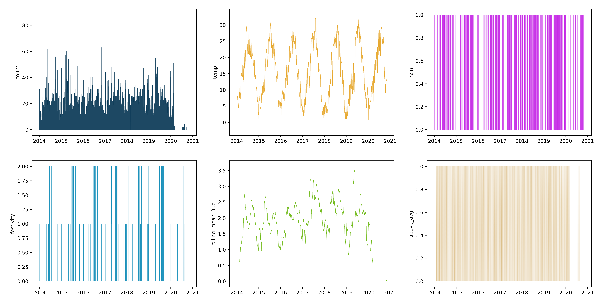
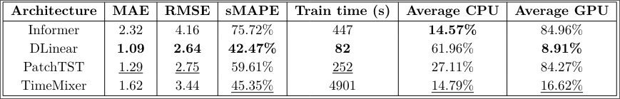

# Overtourism prediction with SOTA Linear, MLP and Transformer time-series models

With the aim of avoiding overtourism phenomena in the municipality of Verona, an analysis of several state-of-the-art models for time series forecasting was conducted. In particular, the project focused on some innovative deep learning models such as Informer, DLinear, PatchTST, and TimeMixer.

## Dataset
The dataset is composed of the count of touristic entrances in the "Anfiteatro" of Verona on a 15 minutes aggregation. The data ranges from the beginning of 2014 until the end of 2019, giving the team a total of 6 years of data. The dataset has been enhanced with some additional information about the days in which the entrances were recorded, aiming at giving the models additional information to increase prediction accuracy. A complete list of the variables can be found here:
- **date.** With the format *y/m/d H/M/S*, it represents the 15 minute range in which the entrances were recorded. (str)
- **count.** It represents the number of entrances recorded. (int)
- **temp.** Average temperature recorded during that day. (float)
- **rain.** Wether or not it rained during that day. (binary)
- **festivity.** Wether or not the specific day was a festivity in Italy. (binary)
- **rolling_mean_30d.** The rolling average of the count column with a 30 day range. (float)
- **above_avg.** Wether or not the *count* value is above or below the rolling mean. (binary)

  

## Results

The final results can be analyzed in the following table. 

  

It is clear that, when it comes to accuracy, time and efficiency DLinear is the best overall model for this task.

## References

- **DLinear** – Zeng et al., *Are Transformers Effective for Time Series Forecasting?*  
  Paper: https://arxiv.org/abs/2205.13504  
  Code: https://github.com/cure-lab/LTSF-Linear

- **Informer** – Zhou et al., *Informer: Beyond Efficient Transformer for Long Sequence Time-Series Forecasting*  
  Paper: https://arxiv.org/abs/2012.07436  
  Code: https://github.com/zhouhaoyi/Informer2020

- **PatchTST** – Nie et al., *A Time Series is Worth 64 Words*  
  Paper: https://arxiv.org/abs/2211.14730  
  Code: https://github.com/PatchTST/PatchTST

- **TimeMixer** – Wang et al., *TimeMixer: Decomposable Multiscale Mixing for Time Series Forecasting*  
  Paper: https://arxiv.org/abs/2405.14616
  Code: https://github.com/kwuking/TimeMixer
